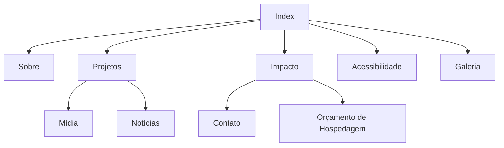

# Escopo do Projeto – EducaVerde
Disciplina: Front-End para Web – A2 Professor: Prof. Paulo Fratta Instituição:
UNICID – Curso Superior de Informática Data: Setembro de 2026 Nome do
Projeto: EducaVerde – Educação que Transforma Pessoas e o Planeta
Integrantes da equipe:
- Abner Barbosa Machado
- Kauã Freitas Passos Perroni
- Luis Cauan Sena Rodrigues
1. Contexto e Justificativa
A educação é uma das principais ferramentas para promover mudanças sociais e
ambientais. Por meio do conhecimento, é possível incentivar práticas
sustentáveis, reduzir desigualdades e ampliar o acesso à informação para
diferentes públicos, incluindo pessoas com deficiência.
O projeto EducaVerde foi criado para divulgar conteúdos educativos sobre
sustentabilidade, inclusão social e cidadania, oferecendo uma plataforma
acessível e informativa. Sua proposta demonstra como a educação está
diretamente ligada ao desenvolvimento sustentável, ao incentivar a
conscientização ambiental, promover a inclusão de pessoas com deficiência e
contribuir para a formação de cidadãos mais responsáveis e participativos na
sociedade.
2. Objetivos
Objetivo Geral
Desenvolver um site educativo em HTML5 e CSS3 que conscientize os usuários
sobre a importância da educação como instrumento de transformação social e
desenvolvimento sustentável.
Objetivos Específicos
• Divulgar projetos educacionais sustentáveis.
• Incentivar práticas ambientais dentro das escolas e comunidades.
• Promover a inclusão de pessoas com deficiência por meio de recursos
acessíveis.
• Apresentar dados e informações sobre o impacto da educação na
sociedade.
• Disponibilizar conteúdos multimídia e um canal de contato com validação
em HTML5.
3. Público-Alvo
O site será destinado a:
• estudantes do ensino fundamental, médio e superior;
• professores e educadores;
• famílias interessadas em educação sustentável;
• organizações sociais;
• pessoas com deficiência, consideradas público prioritário.
Faixa etária: a partir de 12 anos.
4. Escopo Funcional
O site possuirá dez páginas interligadas.
Página Função
index.html /Apresentação do projeto e menu principal
sobre.html /História, missão, visão e valores
projetos.html /Projetos educativos e sustentáveis
impacto.html /Dados, gráficos e tabelas
acessibilidade.html /Recursos de inclusão para PCD
galeria.html /Imagens com legendas
midia.html /Vídeo, áudio e iframe
noticias.html /Notícias e artigos
contato.html /Formulário validado e membros da equipe
orcamento_hospedagem.html /Comparativo de hospedagem e domínio
Funcionalidades principais
• Menu de navegação presente em todas as páginas.
• Formulário de contato com validação HTML5.
• Galeria de imagens.
• Conteúdos em vídeo, áudio e mapa incorporado.
• Navegação simples e intuitiva.
5. Escopo Não Funcional
Acessibilidade
• Textos alternativos (alt) em todas as imagens.
• Alto contraste entre texto e fundo.
• Navegação por teclado.
• Uso de HTML semântico.
• Atributos ARIA quando necessários.
Sustentabilidade
• Conteúdo educativo sobre práticas sustentáveis.
• Imagens otimizadas para reduzir carregamento.
• Sugestão de hospedagem com menor impacto ambiental.
Responsividade
O site será adaptado para:
• celular;
• tablet;
• computador.
Desempenho
• Código organizado.
• CSS externo.
• Imagens comprimidas.
SEO Básico
• Títulos únicos.
• Meta descrição.
• Hierarquia correta de títulos (h1, h2 e h3).
## 6. Mapa do Site

Todas as páginas poderão ser acessadas pelo menu principal.
7. Conteúdo e Identidade Visual
Identidade
Nome: EducaVerde
Slogan: Educação que transforma pessoas e o planeta.
Paleta de Cores
Verde (#2E7D32) — sustentabilidade
Azul (#1565C0) — confiança
Branco — leveza
Cinza (#555555) — textos
Tipografia
• Poppins
• Arial (fonte alternativa)
Tom de voz
O conteúdo utilizará linguagem clara, educativa e acolhedora.
As imagens utilizadas serão autorais ou provenientes de bancos gratuitos, com a
devida indicação da fonte.
8. Tecnologias e Ferramentas
O desenvolvimento utilizará:
• HTML5
• CSS3
• JavaScript
• Visual Studio Code
• GitHub (controle de versão)
• W3C Validator para validação do código
9. Cronograma e Divisão de Tarefas
Etapa Responsável
Estrutura HTML Abner
Desenvolvimento CSS Luis cauã
Produção do conteúdo Kauã
Testes e validação Toda a equipe
Ferramenta de organização
- Trello.
10. Riscos e Restrições
Possíveis riscos
• Prazo reduzido.
• Dificuldade na integração das páginas.
• Falta de imagens adequadas.
• Necessidade de ajustes de acessibilidade.
Restrições
• Desenvolvimento prioritariamente em HTML5 e CSS.
• Cumprimento dos requisitos obrigatórios da disciplina.
11. Critérios de Aceitação
O projeto será considerado concluído quando apresentar:
• 10 páginas HTML totalmente interligadas.
• Navegação funcionando corretamente.
• Formulário validado com recursos do HTML5.
• Recursos de acessibilidade implementados.
• Conteúdo relacionado à educação, sustentabilidade e impacto social.
• Código validado pelo W3C Validator.
• Estrutura de pastas conforme especificação da atividade
